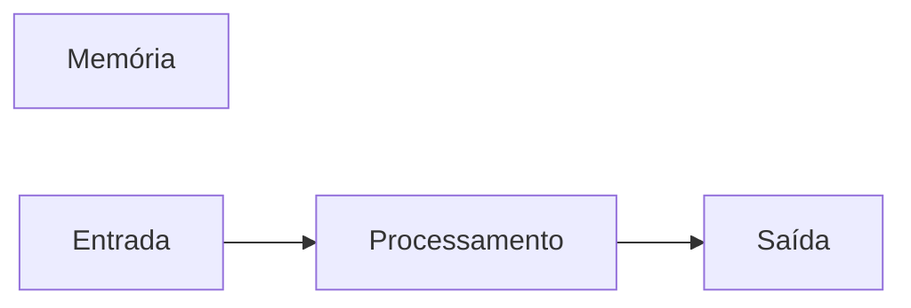

# JavaScript
Repositório usado para estudo de Lógica de Programação com uso da linguagem JavaScript
## Autor
Gustavo Henrique
---
## Variáveis
Variáveis são espaço na memória do computador usados para guardar valoresa que podem alterar ao longo do programa.
### Principais tipos primitivos:
- strings (texto)
- number (números inteiros e não inteiros)
- boolean (verdadeiro ou falso)

## Operadores Aritméricos

| Operador | Propósito | Exemplo | Resultado |
|----------|-----------|---------|-----------|
| = | Atriubuir um valor | x = 10 | x = 10 |
| + | Somar | 10 + 5 | 15 |
| += | Somar e atribuir | x += 5 | x = 10 |
| - | Subtrair | 10 - 5 | 5 |
| -= | Subtrair e atribuir | x -= 5 | x = 5 |
| * | Multiplicar | 5 * 4 | 20 |
| *= | Multiplicar e atribuir | x *= 4 | x = 20 |
| / | Dividir | 20 / 2 | 10 |
| /= | Divir e atribuir | x /= 2 | 10 |
| ++ | Somar 1 ao resultado | x++ | 11 |
| -- | Subtrair 1 do resultado | x-- | 10 |
| % | Resto da divisão | 10&3 | 1 |
